# AWS Capstone: Serverless API and Containerized Web Application

## Overview

This project demonstrates the design and deployment of a cloud-native application on AWS using two independent components: a containerized static web application served via Amazon ECS Fargate, and a serverless REST API built with AWS Lambda and Amazon API Gateway.

Infrastructure provisioning is managed through AWS CloudFormation, applying Infrastructure as Code principles. Monitoring is handled using Amazon CloudWatch Logs and a CloudWatch Dashboard.

---

## Architecture Overview

```
Browser
   |
   |-- ECS Fargate (Public IP)
   |       |
   |       +-- Docker Container (Nginx)
   |               |
   |               +-- Static HTML Page
   |
   +-- Amazon ECR
   |       |
   |       +-- Docker Image Repository
   |
   +-- Amazon API Gateway (REST API)
           |
           +-- POST /submit
                   |
                   +-- AWS Lambda (Node.js)
                           |
                           +-- Amazon CloudWatch Logs
```

The ECS Fargate infrastructure (cluster, task definition, service, security group, and IAM role) is provisioned entirely through a CloudFormation template (`infrastructure.yml`). The Lambda function and API Gateway were configured separately via the AWS Management Console and CLI.

---

## Technologies Used

| Category                | Technology                        |
| ----------------------- | --------------------------------- |
| Infrastructure as Code  | AWS CloudFormation                |
| Container Registry      | Amazon ECR                        |
| Container Orchestration | Amazon ECS (Fargate)              |
| Serverless Compute      | AWS Lambda (Node.js)              |
| API Management          | Amazon API Gateway (REST API)     |
| Web Server              | Nginx (Docker, Alpine base image) |
| Monitoring              | Amazon CloudWatch                 |
| Access Control          | AWS IAM Roles                     |
| Tooling                 | Docker, AWS CLI                   |

---

## Repository Structure

```
.
+-- infrastructure.yml        # CloudFormation template for ECS infrastructure
+-- lamba-api/
|   +-- index.js              # Lambda function handler
+-- webapp/
|   +-- Dockerfile            # Docker image definition
|   +-- index.html            # Static web page
+-- images/                   # Project screenshots
+-- README.md
```

---

## Infrastructure

The file `infrastructure.yml` is an AWS CloudFormation template that provisions all ECS-related infrastructure from a single deployment command. It accepts one parameter:

- `ImageURI` — the full URI of the Docker image stored in Amazon ECR.

### Resources Created

| Resource               | Type                       | Details                                           |
| ---------------------- | -------------------------- | ------------------------------------------------- |
| `ECSCluster`           | `AWS::ECS::Cluster`        | Named `CapstoneCluster`                           |
| `WebAppSecurityGroup`  | `AWS::EC2::SecurityGroup`  | Allows inbound TCP on port 80 from `0.0.0.0/0`    |
| `ECSTaskExecutionRole` | `AWS::IAM::Role`           | Grants ECS the `AmazonECSTaskExecutionRolePolicy` |
| `TaskDefinition`       | `AWS::ECS::TaskDefinition` | Fargate, `awsvpc`, 256 CPU units, 512 MB memory   |
| `ECSService`           | `AWS::ECS::Service`        | 1 desired task, public IP enabled, Fargate launch |

### Outputs

The template exports the cluster name, task definition reference, and service name for reference after deployment.

---

## Containerized Web Application

### How It Works

A simple static HTML page is packaged into a Docker image using the official `nginx:alpine` base image. The image is pushed to a private Amazon ECR repository, and ECS Fargate pulls and runs it as a containerized task.

### Docker Image

`webapp/Dockerfile`:

```dockerfile
FROM nginx:alpine

COPY index.html /usr/share/nginx/html/index.html

EXPOSE 80
```

The image was built and pushed to ECR using the AWS CLI:

```bash
# Authenticate Docker with ECR
aws ecr get-login-password --region <region> | docker login --username AWS --password-stdin <account-id>.dkr.ecr.<region>.amazonaws.com

# Build, tag, and push
docker build -t capstone-webapp .
docker tag capstone-webapp:latest <ecr-uri>:latest
docker push <ecr-uri>:latest
```

### ECS Deployment

The CloudFormation stack was deployed with the ECR image URI passed as a parameter:

```bash
aws cloudformation deploy \
  --template-file infrastructure.yml \
  --stack-name CapstoneStack \
  --parameter-overrides ImageURI=<ecr-uri>:latest \
  --capabilities CAPABILITY_IAM
```

Once the service reached a running state, the application was accessible via the public IP address assigned to the Fargate task on port 80.

---

## Serverless API

### How It Works

An HTTP POST request is sent to an Amazon API Gateway REST API endpoint. API Gateway proxies the request to an AWS Lambda function. The Lambda function logs the incoming payload to CloudWatch Logs and returns a JSON response containing a randomly generated submission ID.

### Lambda Function

`lamba-api/index.js`:

```javascript
import crypto from "crypto";

export const handler = async (event) => {
  try {
    console.log("Received data:", body);

    const submissionId = crypto.randomUUID();

    return {
      statusCode: 200,
      headers: { "Content-Type": "application/json" },
      body: JSON.stringify({
        message: "Data successfully received and logged!",
        id: submissionId,
      }),
    };
  } catch (err) {
    console.error(err);
    return {
      statusCode: 400,
      body: JSON.stringify({
        message: "Invalid request",
        error: err.message,
      }),
    };
  }
};
```

- Runtime: Node.js (ES module syntax using `import`)
- Uses Node's built-in `crypto` module to generate a UUID via `crypto.randomUUID()`
- Returns a `400` response with the error message if an exception is thrown

### API Gateway Configuration

- Type: REST API
- Method: POST
- Integration: Lambda proxy integration
- The API was deployed to a stage and the endpoint URL was used for testing

---

## Monitoring

### CloudWatch Logs

Each Lambda invocation writes log output to a CloudWatch Logs log group automatically created for the function. Logs were used to confirm that requests were reaching the function and that the payload was being received.

### CloudWatch Dashboard

A CloudWatch Dashboard was created containing two metric widgets:

| Widget             | Metric Source                | Purpose                                   |
| ------------------ | ---------------------------- | ----------------------------------------- |
| Lambda Invocations | `AWS/Lambda` - `Invocations` | Tracks the total number of function calls |
| Lambda Errors      | `AWS/Lambda` - `Errors`      | Tracks the number of failed invocations   |

Multiple POST requests were sent to the API Gateway endpoint to generate visible metric data in the dashboard.

---

## Deployment Summary

| Component            | Provisioning Method    | Runtime               |
| -------------------- | ---------------------- | --------------------- |
| ECS Cluster          | CloudFormation         | AWS-managed (Fargate) |
| ECS Task Definition  | CloudFormation         | AWS-managed (Fargate) |
| ECS Service          | CloudFormation         | AWS-managed (Fargate) |
| Security Group       | CloudFormation         | N/A                   |
| IAM Execution Role   | CloudFormation         | N/A                   |
| Docker Image         | Docker CLI + AWS CLI   | Amazon ECR            |
| Lambda Function      | AWS Management Console | Node.js (ES Module)   |
| API Gateway          | AWS Management Console | REST API              |
| CloudWatch Dashboard | AWS Management Console | N/A                   |

---

## Testing

### Web Application

1. After the CloudFormation stack deployed successfully, the public IP address of the running ECS task was retrieved from the ECS console.
2. The IP was opened in a browser on port 80 to confirm the static page was served correctly by Nginx.

### Serverless API

The API Gateway POST endpoint was tested using `curl`:

```bash
curl -X POST https://<api-id>.execute-api.<region>.amazonaws.com/<stage>/submit \
  -H "Content-Type: application/json" \
  -d '{"name": "Test User", "message": "Hello from curl"}'
```

Expected response:

```json
{
  "message": "Data successfully received and logged!",
  "id": "xxxxxxxx-xxxx-xxxx-xxxx-xxxxxxxxxxxx"
}
```

### CloudWatch Logs

After sending requests to the API, the Lambda log group was opened in the CloudWatch console. Log streams confirmed that invocations were received and the console output was recorded.

### CloudWatch Dashboard

The dashboard was opened in the CloudWatch console. After multiple test requests, the Invocations and Errors widgets showed populated metric data.

---

## Screenshots

## Docker

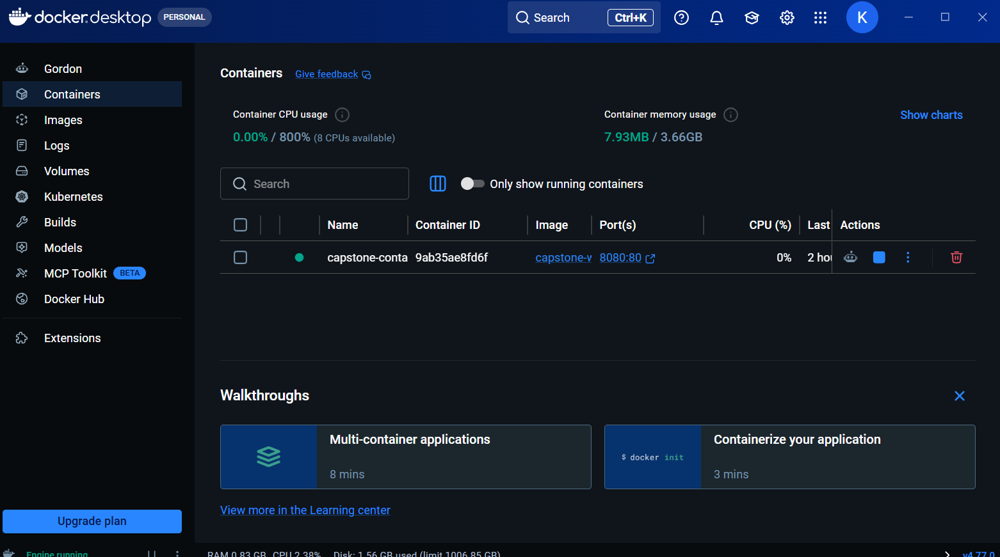

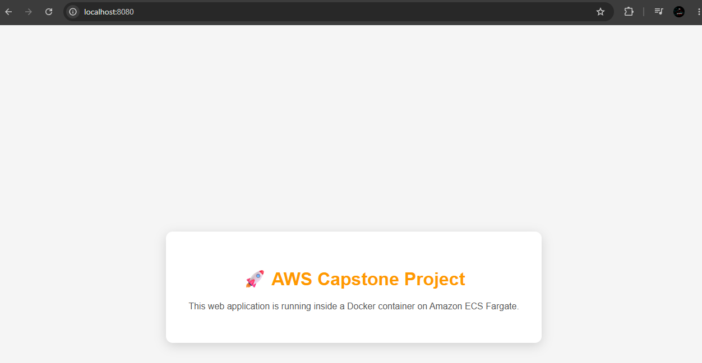

### CloudFormation Stack

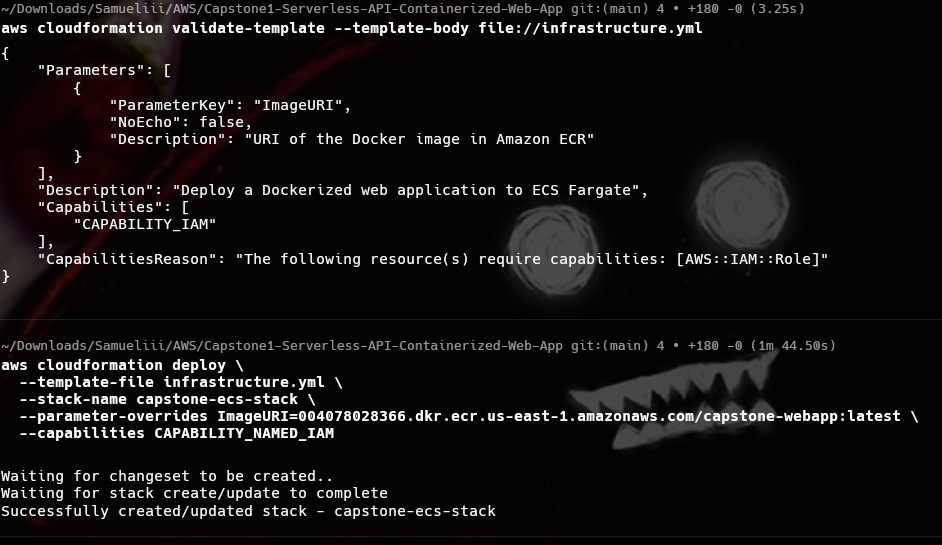

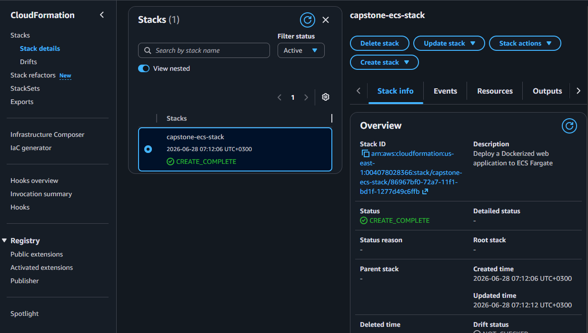

### Lambda

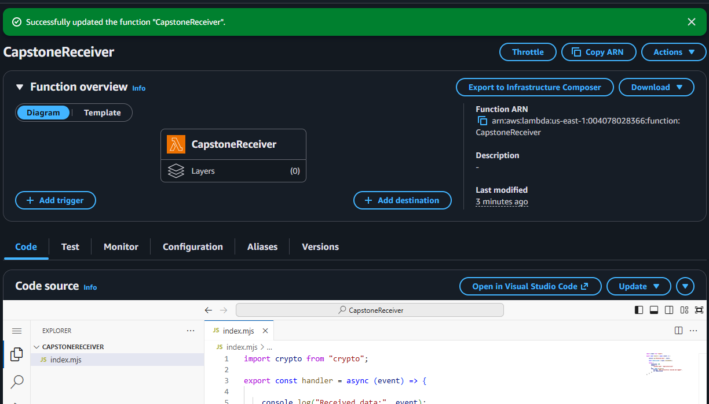

### Amazon ECR Repository

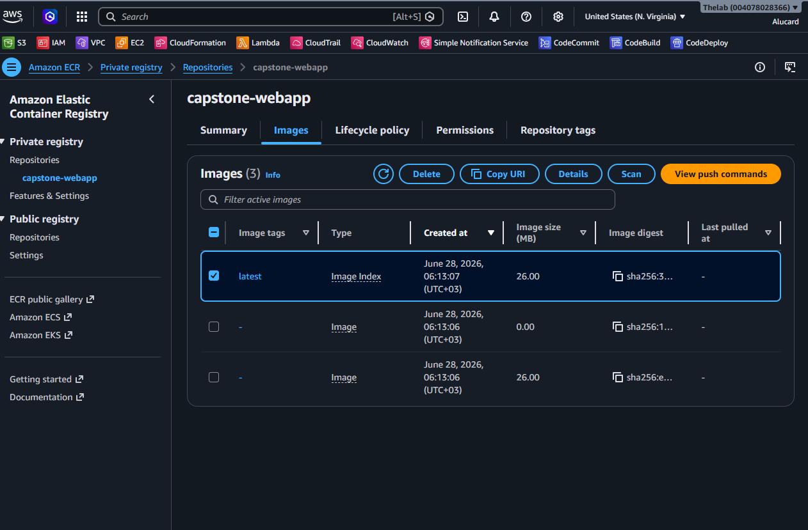

### ECS Cluster

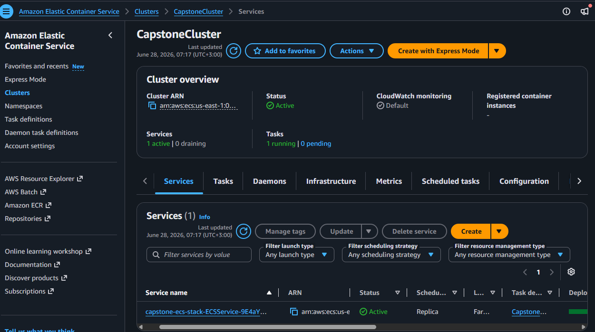

### ECS Service

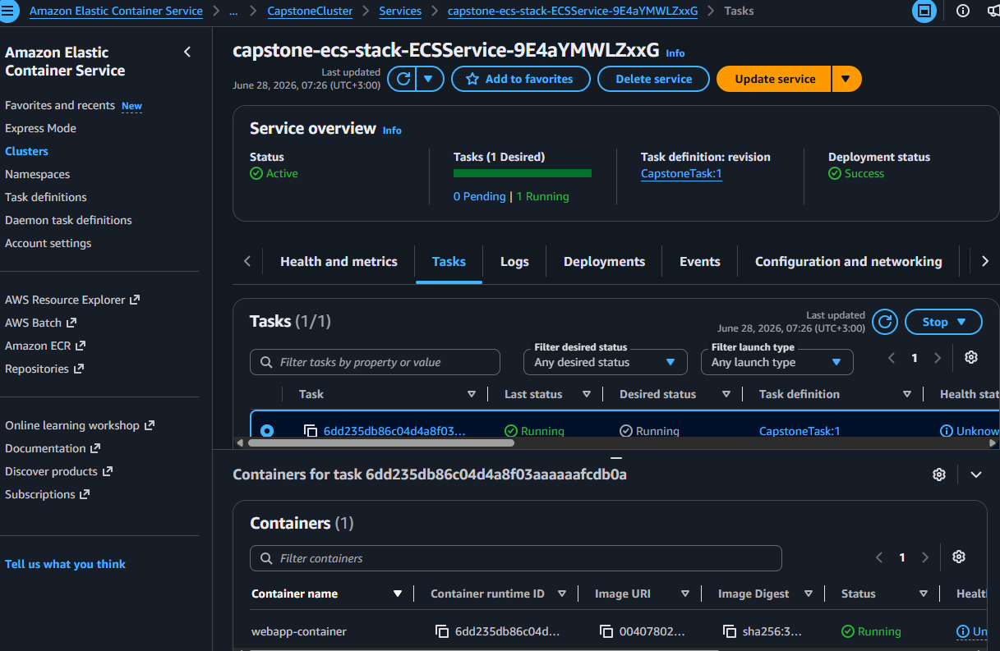

### Live Web Application

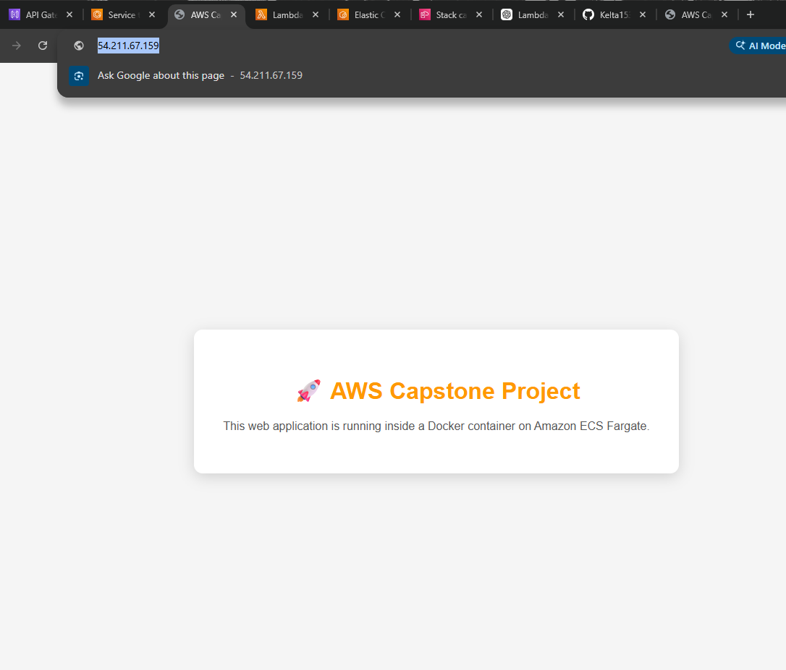

### API Gateway curl Test

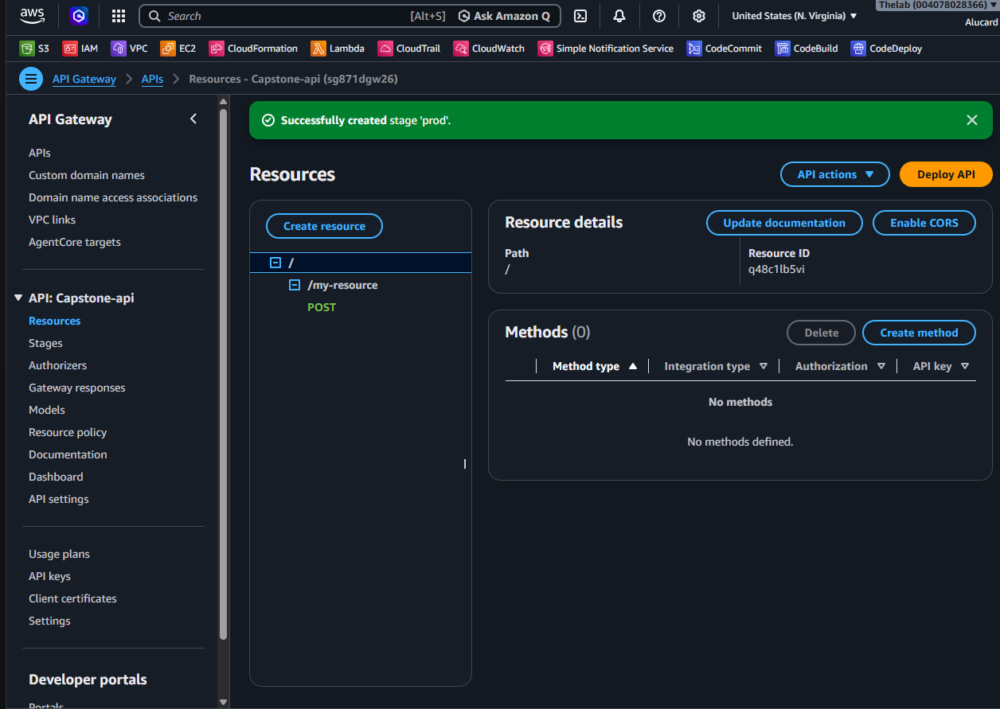

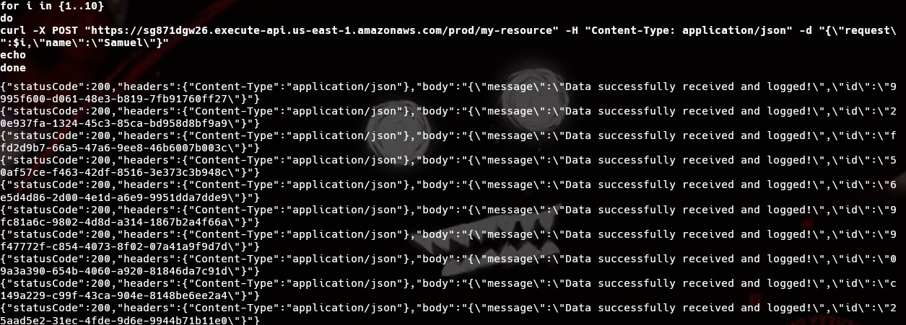

### CloudWatch Logs

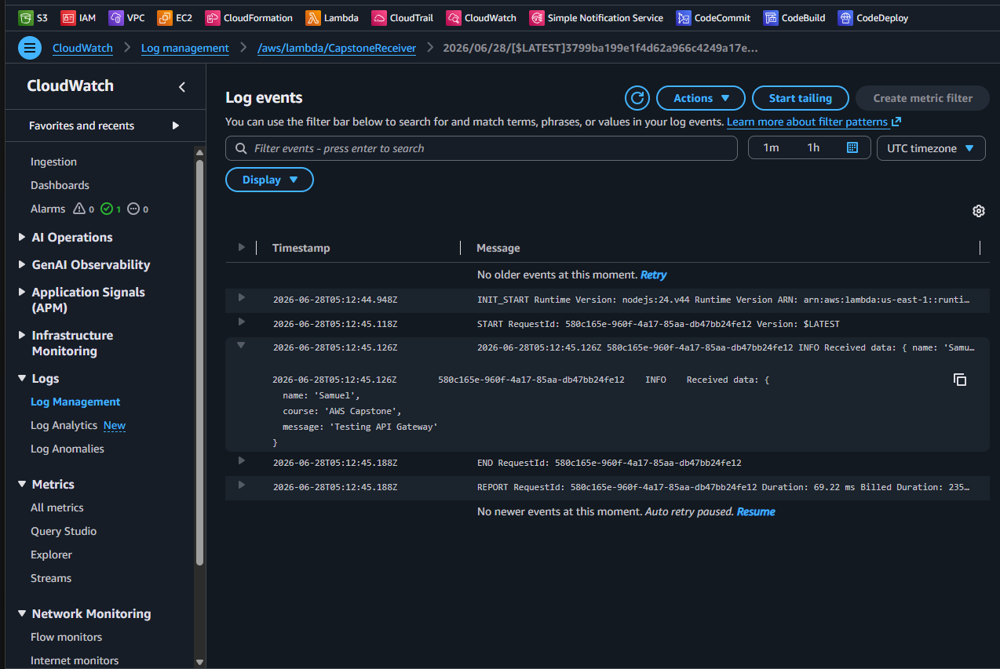

### CloudWatch Dashboard


---

## Learning Outcomes

This project demonstrates practical competency in the following areas:

- **Infrastructure as Code** — using AWS CloudFormation to define, version, and deploy cloud infrastructure declaratively
- **Containerization** — building Docker images, managing them in a private container registry (ECR), and running them on a managed container platform (ECS Fargate) without provisioning or managing servers
- **Serverless architecture** — implementing event-driven compute using AWS Lambda, triggered through a managed API layer (API Gateway)
- **Cloud networking** — configuring VPC security groups and Fargate networking to control public access
- **IAM and least-privilege access** — attaching managed IAM policies to task execution roles to allow ECS to pull images from ECR securely
- **Observability** — using CloudWatch Logs for request-level tracing and CloudWatch Dashboards for operational metrics visibility

---
